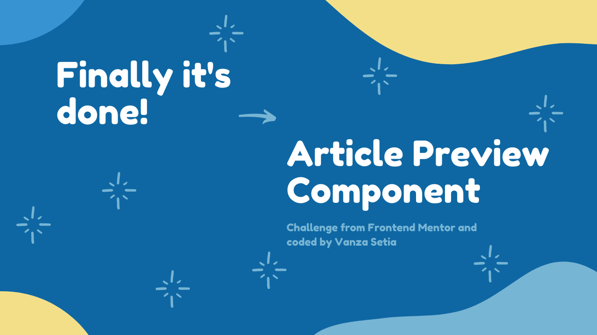

<!-- Banner -->

<!-- ENDOF Banner-->

<!-- Badges -->

  
  
  
  
  
  

<!-- ENDOF Badges -->

<!-- Other Badges -->

  
    

<!-- ENDOF Other Badges -->

<!-- Title -->
# Article Preview Component
<!-- Title -->

<!-- Table Of Contents -->
## Table of contents
- [Overview](#overview)
  - [Introduction](#introduction)
  - [The challenge](#the-challenge)
  - [Links](#links)
  - [Screenshot](#screenshot)
- [My process](#my-process)
  - [Built with](#built-with)
- [Author](#author)
- [Acknowledgements](#acknowledgements)
- [License](#license)
- [References](#references)
<!-- ENDOF Table Of Contents -->

<!-- Overview -->
## Overview
[(Back to top)](#table-of-contents)

### Introduction
Welcome to the `README.md` of this repo! The purpose of creating this project is to increase my coding skill.

In this file I'm going to tell you everything, start from tools that I used, and much more.

That's it for the introduction and **happy reading!**

### The Challenge
The challenge is to build out this article preview component and get it looking as close to the design as possible.

The users should be able to:

* View the optimal layout for the component depending on their device's screen size
* See the social media share links when they click the share icon
* Navigate the component using assistive technology

### Links
- [🌐 Live Review](https://articlepreviewcomponentvanza.netlify.app/)
- [👨‍🏫 Frontend Mentor Solution Page](https://www.frontendmentor.io/solutions/article-preview-component-html-css-sass-js-xPXxRQyOK)

### Screenshot

<!-- ENDOF Overview -->

<!-- My Process -->
## My Process
[(Back to top)](#table-of-contents)

### Built With
- Following best practices* :star:
- HTML Semantic Tags
- [BEM (Block, Element, Modifier)](https://sparkbox.com/foundry/bem_by_example) - class naming convention
- [Sass](https://sass-lang.com/)
- Vanilla JavaScript
- CSS Flexbox
- Mobile-first workflow
- [Normalize.css](https://necolas.github.io/normalize.css/)

> \* *I follow guidelines. [See what guidelines that I follow.](./docs/README.md#guidelines)* 
<!-- ENDOF My Process -->

<!-- Author -->
## Author
[(Back to top)](#table-of-contents)

- Frontend Mentor - [@vanzasetia](https://frontendmentor.io/profile/vanzasetia)
- Twitter - [@vanzasetia](https://twitter.com/vanzasetia)
- Code Newbie - [@vanzasetia](https://community.codenewbie.org/vanzasetia)
- Want to see me on other platform? [Check my linktree!](https://linktr.ee/vanzasetia)
<!-- ENDOF Author -->

<!-- Acknowledgements -->
## Acknowledgements
[(Back to top)](#table-of-contents)

The motivation to create a great `README.md` is coming from [awesome-readme repository](https://github.com/matiassingers/awesome-readme/blob/master/readme.md) where it lists a lot of great projects with awesome `README.md`.
<!-- END OF Acknowledgements -->

<!-- LICENSE -->
## License
[(Back to top)](#table-of-contents)

>You can check out [the full license](./LICENSE)

This project is licensed under the terms of the MIT license.

For those of you who are wondering, why do I need to license this? 
- Well, first it's free 😁.
- Second I checked this [Choose license website](https://choosealicense.com/) to help me chose a license.
- The last reason, if I don't want to choose a license, then [here's what gonna happen](https://choosealicense.com/no-permission/).
<!-- ENDOF LICENSE -->

<!-- References -->
## References

[(Back to top)](#table-of-contents)

> See the [documentation.](./docs/README.md)
<!-- ENDOF References -->
